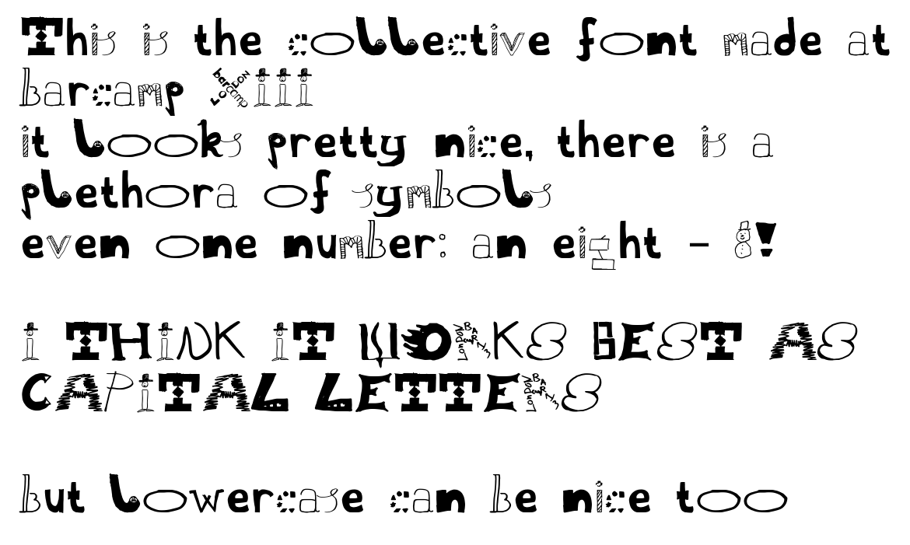

# barcamp 13 communal typeface

a communal typeface, created at <https://thirteen.barcamplondon.org/> using paper & pens, and compiled using [FontForge](https://fontforge.org).

## letters & characters

`ABCDEFGHIJKLMNOPQRST  WXYZ`  
`abcd fg ijklmnopq st vwxyz`  
`       8  `  
`.,!?:;[]{}&@`  
`ñα⏻🜨`

extra (missing) letters are (temporarily ???) filled in with letters from [bogface](https://github.com/alifeee/bogface/).

licence: this font has no licence, modify and use as you feel
